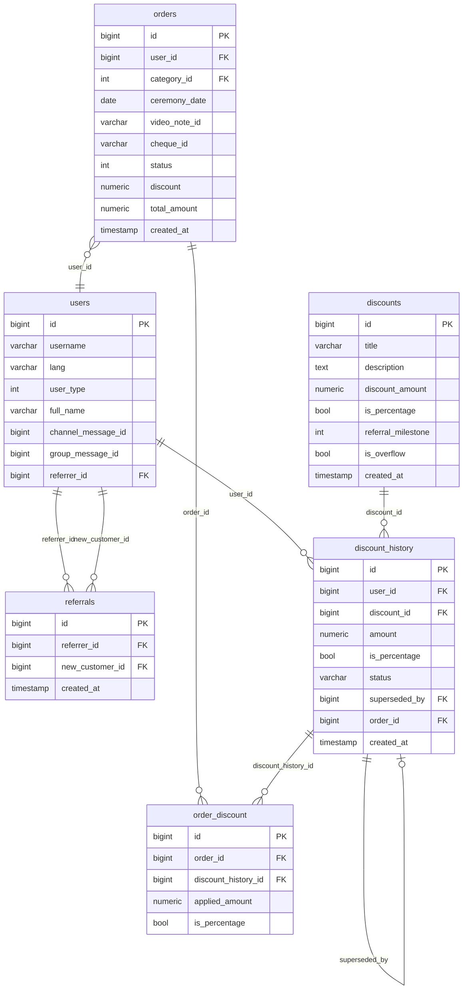

# 🎯 Referral & Discount System — Final Plan (v4)

> **Project**: ismobot · **Updated**: 2026-08-29
> **Change from v3**: No-discount path skips picker entirely → straight to `cheque_id`

---

## 📋 Goal

Full referral + discount system with two discount types:

| Referrals | Reward type | Reward |
|---|---|---|
| 1st referral | Percentage | 20% off |
| 2nd referral | Percentage | 50% off (upgrades 20%) |
| 3rd referral | Percentage | 100% off (upgrades 50%) |
| 4th+ referral | Discrete | +10 000 so'm per extra person |

**Discount picker UI** (only shown when user HAS discounts):
```
"Please choose a discount:"
┌────────────────────────┐
│  🎁 100% off           │  ← only if percentage discount exists
│  💵 20 000 so'm        │  ← only if discrete balance > 0
│  ❌ Pay full price      │  ← always shown in picker
└────────────────────────┘
```

**No discounts → skip picker, go straight to cheque screenshot request.**

---

## ✅ Implementation Checklist

### Phase 1 — Config & Env
- [x] **1.1** Rename `FAST_DELIVERY` → `ORDER_PRICE` in `Config.py`
- [x] **1.2** Add `OVERFLOW_DISCOUNT_AMOUNT = 10000` to `Config.py`

### Phase 2 — Database Models + Migration
- [x] **2.1** Add `referrer_id` column to `users` table
- [x] **2.2** Create `discounts` table (replaces `promotions`) + seed 4 rows
- [x] **2.3** Create `referrals` table
- [x] **2.4** Add `discount` + `total_amount` columns to `orders` table (defaults: 0 / ORDER_PRICE)
- [x] **2.5** Create `order_discount` table
- [x] **2.6** Create `discount_history` table
- [x] **2.7** Write single Alembic migration for all the above

### Phase 3 — Database CRUD Layer
- [x] **3.1** Update `database/Users.py` — `referrer_id` in `create`; add `set_referrer`
- [x] **3.2** Create `database/Discounts.py` — milestone lookup, overflow row, seed
- [x] **3.3** Create `database/Referrals.py` — create, count, exists
- [x] **3.4** Create `database/DiscountHistory.py` — earn_milestone, earn_overflow, get_available_summary, consume
- [x] **3.5** Create `database/OrderDiscount.py` — create, get_by_order
- [x] **3.6** Update `database/Orders.py` — create with discount/total_amount; add `get_pending_by_user`

### Phase 4 — Bot Handlers & UX
- [x] **4.1** Update `handlers/States.py` — add `OrderState.select_discount`
- [x] **4.2** Update `handlers/keyboard.py` — 5 new keyboard builders (no `payment_keyboard` needed)
- [x] **4.3** Create `handlers/referral.py` — referral menu, invite, discounts, use_earned_discount
- [x] **4.4** Update `handlers/common.py` — deep link parsing + new 3-button main menu
- [x] **4.5** Update `handlers/orders.py` — discount check post-video_note; apply_pct/dis; skip; confirm_pay; cheque
- [x] **4.6** Update `handlers/admin_orders.py` — post-completion referrer notification + discount award
- [x] **4.7** Update `handlers/router.py` — include `referral.router`

### Phase 5 — Translations & Text Polish
- [x] **5.1** Add ~22 new strings to `Translation.py` (ru + uz, emoji-rich, short)
- [x] **5.2** Shorten existing long messages per spec

### Phase 6 — Documentation
- [x] **6.1** Create `PROJECT.md`

---

## 🗂 Database Schema

### ER Diagram



### `discounts` table (4 seed rows)

```sql
CREATE TABLE discounts (
    id                 BIGSERIAL PRIMARY KEY,
    title              VARCHAR(255) NOT NULL,
    description        TEXT,
    discount_amount    NUMERIC(10,2) NOT NULL,
    is_percentage      BOOLEAN NOT NULL DEFAULT FALSE,
    referral_milestone INT DEFAULT NULL,   -- 1,2,3 for milestones; NULL for overflow
    is_overflow        BOOLEAN NOT NULL DEFAULT FALSE,
    created_at         TIMESTAMP DEFAULT now()
);
-- Seeds:
-- (1-friend 20%,  20.00, TRUE,  milestone=1, overflow=FALSE)
-- (2-friend 50%,  50.00, TRUE,  milestone=2, overflow=FALSE)
-- (3-friend 100%, 100.00, TRUE, milestone=3, overflow=FALSE)
-- (overflow,    10000.00, FALSE, milestone=NULL, overflow=TRUE)
```

### `referrals` table

```sql
CREATE TABLE referrals (
    id               BIGSERIAL PRIMARY KEY,
    referrer_id      BIGINT NOT NULL REFERENCES users(id) ON DELETE CASCADE,
    new_customer_id  BIGINT NOT NULL UNIQUE REFERENCES users(id) ON DELETE CASCADE,
    created_at       TIMESTAMP DEFAULT now()
);
```

### `discount_history` table (ledger)

```sql
CREATE TABLE discount_history (
    id             BIGSERIAL PRIMARY KEY,
    user_id        BIGINT NOT NULL REFERENCES users(id) ON DELETE CASCADE,
    discount_id    BIGINT REFERENCES discounts(id) ON DELETE SET NULL,
    amount         NUMERIC(10,2) NOT NULL,
    is_percentage  BOOLEAN NOT NULL DEFAULT FALSE,
    status         VARCHAR(20) NOT NULL DEFAULT 'active',  -- 'active'|'consumed'|'superseded'
    superseded_by  BIGINT REFERENCES discount_history(id) ON DELETE SET NULL DEFAULT NULL,
    order_id       BIGINT REFERENCES orders(id) ON DELETE SET NULL DEFAULT NULL,
    created_at     TIMESTAMP DEFAULT now()
);
```

### `order_discount` table

```sql
CREATE TABLE order_discount (
    id                   BIGSERIAL PRIMARY KEY,
    order_id             BIGINT NOT NULL REFERENCES orders(id) ON DELETE CASCADE,
    discount_history_id  BIGINT REFERENCES discount_history(id) ON DELETE SET NULL,
    applied_amount       NUMERIC(10,2) NOT NULL,
    is_percentage        BOOLEAN NOT NULL DEFAULT FALSE
);
```

### `orders` additions

```sql
ALTER TABLE orders ADD COLUMN discount     NUMERIC(10,2) NOT NULL DEFAULT 0;
ALTER TABLE orders ADD COLUMN total_amount NUMERIC(10,2) NOT NULL DEFAULT 30000;
```

---

## 🗂 Proposed Changes — Detail

---

### Phase 1+2: Config & Models

#### `Config.py` — [MODIFY]

```python
ORDER_PRICE = int(getenv('ORDER_PRICE', 30000))                    # renamed from FAST_DELIVERY
OVERFLOW_DISCOUNT_AMOUNT = int(getenv('OVERFLOW_DISCOUNT_AMOUNT', 10000))
```

#### `database/models.py` — [MODIFY]

```python
# User — add:
referrer_id: Mapped[int | None] = mapped_column(
    BigInteger, ForeignKey("users.id"), default=None
)

# Order — add:
discount: Mapped[Decimal] = mapped_column(Numeric(10, 2), default=Decimal("0"))
total_amount: Mapped[Decimal] = mapped_column(Numeric(10, 2), nullable=False)

# NEW: Discount, Referral, DiscountHistory, OrderDiscount models (see schema above)
```

---

### Phase 3: CRUD Services

#### `database/Discounts.py` — [NEW]

```python
class DiscountsService:
    async def get_by_milestone(self, milestone: int) -> Discount | None: ...
    async def get_overflow(self) -> Discount | None: ...
    async def seed_defaults(self): ...   # idempotent, called on startup
```

#### `database/Referrals.py` — [NEW]

```python
class ReferralsService:
    async def create(self, referrer_id: int, new_customer_id: int) -> Referral: ...
    async def get_count(self, referrer_id: int) -> int: ...
    async def exists(self, new_customer_id: int) -> bool: ...
```

#### `database/DiscountHistory.py` — [NEW]

```python
class DiscountHistoryService:

    async def earn_milestone(self, user_id: int, referral_count: int) -> DiscountHistory | None:
        """
        Awards the milestone percentage discount and supersedes any previous
        active percentage discount for this user.
        """
        ...

    async def earn_overflow(self, user_id: int) -> DiscountHistory:
        """Awards +10 000 so'm per extra referral (stackable)."""
        ...

    async def get_available_summary(self, user_id: int) -> dict:
        """
        Returns:
        {
          "percentage": {"id": 5, "amount": 100, "label": "100% off"} | None,
          "discrete":   {"ids": [6,7], "total": 20000, "label": "20 000 so'm"} | None
        }
        Returns None for each key if no active entry of that type.
        """
        ...

    async def consume(self, user_id: int, history_ids: list[int], order_id: int) -> None:
        """Marks entries as 'consumed' and sets order_id."""
        ...
```

#### `database/OrderDiscount.py` — [NEW]

```python
class OrderDiscountService:
    async def create(self, order_id, applied_amount, is_percentage,
                     discount_history_id=None) -> OrderDiscount: ...
    async def get_by_order(self, order_id) -> OrderDiscount | None: ...
```

#### `database/Orders.py` — [MODIFY]

```python
# create() updated signature:
async def create(self, user_id, category_id, ceremony_date, video_note_id, cheque_id,
                 discount=0, total_amount=None):
    from Config import ORDER_PRICE
    if total_amount is None:
        total_amount = ORDER_PRICE - discount
    ...

# New method:
async def get_pending_by_user(self, user_id: int) -> dict | None:
    """Returns the most recent order with video_note set but cheque_id not yet submitted."""
    ...
```

---

### Phase 4: Handlers

#### `handlers/States.py` — [MODIFY]

```python
class OrderState(StatesGroup):
    category = State()
    delivery_type = State()
    ceremony_date = State()
    video_note_id = State()
    select_discount = State()   # NEW — shown only when user has discounts
    cheque_id = State()
```

#### `handlers/keyboard.py` — [MODIFY]

Five new builders (**`payment_keyboard` removed** — no longer needed):

```python
def main_menu_keyboard(lang_=_lang) -> InlineKeyboardMarkup:
    # 📸 Order Photo | 👥 Invite Friends | 📞 Contact Admin
    ...

def invite_friends_menu_keyboard(lang_=_lang) -> InlineKeyboardMarkup:
    # 🎁 My Discounts | 📤 Invite Friends | 🏠 Main Menu
    ...

def discount_picker_keyboard(summary: dict, lang_=_lang) -> InlineKeyboardMarkup:
    """
    Builds up to 3 rows depending on what summary contains.
    Only called when summary has at least one non-None value.
    """
    rows = []
    if summary.get("percentage"):
        d = summary["percentage"]
        rows.append([InlineKeyboardButton(
            text=f"🎁 {d['label']}",
            callback_data=f"apply_discount:pct:{d['id']}"
        )])
    if summary.get("discrete"):
        d = summary["discrete"]
        rows.append([InlineKeyboardButton(
            text=f"💵 {d['label']}",
            callback_data=f"apply_discount:dis:{','.join(str(i) for i in d['ids'])}"
        )])
    rows.append([InlineKeyboardButton(
        text=_("❌ Chegirimsiz to'lash", lang_),
        callback_data="skip_discount"
    )])
    return InlineKeyboardMarkup(inline_keyboard=rows)

def pay_now_keyboard(total_amount: int, lang_=_lang) -> InlineKeyboardMarkup:
    """Shown after discount is selected — confirms the discounted price."""
    amount_str = f"{total_amount:,}".replace(",", " ")
    return InlineKeyboardMarkup(inline_keyboard=[
        [InlineKeyboardButton(
            text=f"✅ To'lash: {amount_str} so'm",
            callback_data="confirm_pay"
        )]
    ])

def use_discount_keyboard(lang_=_lang) -> InlineKeyboardMarkup:
    """Sent to referrer after a friend completes an order."""
    return InlineKeyboardMarkup(inline_keyboard=[
        [InlineKeyboardButton(
            text=_("🎁 Chegirmadan foydalanish", lang_),
            callback_data="use_earned_discount"
        )]
    ])
```

#### `handlers/orders.py` — [MODIFY]

**The critical branch in `order_video_note()`:**

```python
@router.message(OrderState.video_note_id)
async def order_video_note(message: Message, state: FSMContext, lang: str) -> None:
    # ... existing validation unchanged (content_type + 3s duration) ...

    video_note_id = message.video_note.file_id
    await state.update_data(video_note_id=video_note_id)

    # ── Check discount balance ──
    summary = await discount_history_service.get_available_summary(message.from_user.id)
    has_any = summary["percentage"] is not None or summary["discrete"] is not None

    if has_any:
        # ── Branch A: user has discounts → show picker ──
        await state.set_state(OrderState.select_discount)
        await state.update_data(discount_summary=summary)
        price_str = f"{ORDER_PRICE:,}".replace(",", " ")
        await bot.send_message(
            chat_id=message.from_user.id,
            text=_(
                "🎉 Sizda chegirma mavjud!\n"
                "💳 To'lov summasi: <b>{price} so'm</b>\n\n"
                "Qaysi chegirmadan foydalanmoqchisiz?", lang
            ).format(price=price_str),
            reply_markup=discount_picker_keyboard(summary, lang),
            parse_mode=ParseMode.HTML,
        )
    else:
        # ── Branch B: no discounts → skip everything, ask for cheque directly ──
        await state.set_state(OrderState.cheque_id)
        await state.update_data(discount=0, total_amount=ORDER_PRICE)
        await bot.send_message(
            chat_id=message.from_user.id,
            text=_(
                "💳 To'lov summasi: <b>{price} so'm</b>\n"
                "📲 Kartaga o'tkazing: <b>{card}</b>\n\n"
                "✅ To'lovdan so'ng skrinshotni yuboring!", lang
            ).format(price=f"{ORDER_PRICE:,}".replace(",", " "), card=CARD_NUMBER),
            parse_mode=ParseMode.HTML,
            # NO reply_markup — just plain text, wait for photo
        )
```

**Discount apply handlers (only reachable via `select_discount` state):**

```python
# Apply percentage discount
@router.callback_query(F.data.startswith("apply_discount:pct:"), OrderState.select_discount)
async def apply_pct_discount(query: CallbackQuery, state: FSMContext, lang: str) -> None:
    history_id = int(query.data.split(":")[2])
    summary = (await state.get_data()).get("discount_summary", {})
    pct = summary["percentage"]["amount"]
    discount_value = int(ORDER_PRICE * pct / 100)
    total_amount = max(0, ORDER_PRICE - discount_value)
    await state.update_data(discount=discount_value, total_amount=total_amount,
                            applied_history_ids=[history_id], is_percentage=True)
    await state.set_state(OrderState.cheque_id)
    await query.message.answer(
        _("✅ -{pct}% chegirma qo'llanildi!\n"
          "💰 To'lov summasi: <b>{total} so'm</b>\n"
          "📲 Kartaga o'tkazing: <b>{card}</b>", lang).format(
            pct=int(pct),
            total=f"{total_amount:,}".replace(",", " "),
            card=CARD_NUMBER,
        ),
        reply_markup=pay_now_keyboard(total_amount, lang),
        parse_mode=ParseMode.HTML,
    )

# Apply discrete discount
@router.callback_query(F.data.startswith("apply_discount:dis:"), OrderState.select_discount)
async def apply_dis_discount(query: CallbackQuery, state: FSMContext, lang: str) -> None:
    ids_str = query.data.split(":")[2]
    history_ids = [int(i) for i in ids_str.split(",")]
    summary = (await state.get_data()).get("discount_summary", {})
    total_discrete = int(summary["discrete"]["total"])
    discount_value = min(total_discrete, ORDER_PRICE)
    total_amount = max(0, ORDER_PRICE - discount_value)
    await state.update_data(discount=discount_value, total_amount=total_amount,
                            applied_history_ids=history_ids, is_percentage=False)
    await state.set_state(OrderState.cheque_id)
    await query.message.answer(
        _("✅ -{label} chegirma qo'llanildi!\n"
          "💰 To'lov summasi: <b>{total} so'm</b>\n"
          "📲 Kartaga o'tkazing: <b>{card}</b>", lang).format(
            label=f"{total_discrete:,} so'm".replace(",", " "),
            total=f"{total_amount:,}".replace(",", " "),
            card=CARD_NUMBER,
        ),
        reply_markup=pay_now_keyboard(total_amount, lang),
        parse_mode=ParseMode.HTML,
    )

# Skip discount (from picker)
@router.callback_query(F.data == "skip_discount", OrderState.select_discount)
async def skip_discount(query: CallbackQuery, state: FSMContext, lang: str) -> None:
    await query.answer()
    await state.update_data(discount=0, total_amount=ORDER_PRICE, applied_history_ids=[])
    await state.set_state(OrderState.cheque_id)
    await query.message.answer(
        _("💳 To'lov: <b>{price} so'm</b>\n"
          "📲 Kartaga o'tkazing: <b>{card}</b>\n\n"
          "✅ To'lovdan so'ng skrinshotni yuboring!", lang).format(
            price=f"{ORDER_PRICE:,}".replace(",", " "), card=CARD_NUMBER
        ),
        parse_mode=ParseMode.HTML,
        # NO keyboard — just wait for the photo
    )

# confirm_pay — shown after discount is applied to preview discounted total
@router.callback_query(F.data == "confirm_pay")
async def confirm_pay(query: CallbackQuery, state: FSMContext, lang: str) -> None:
    await query.answer()
    await query.message.answer(_("📸 To'lov skrinshotini yuboring!", lang))

# order_cheque_id — unchanged apart from reading discount fields from state
@router.message(OrderState.cheque_id)
async def order_cheque_id(message: Message, state: FSMContext, lang: str) -> None:
    if message.content_type != ContentType.PHOTO:
        await message.answer(_("📸 To'lov skrinshotini yuboring!", lang))
        return
    cheque_id = message.photo[-1].file_id
    data = await state.get_data()
    discount = data.get("discount", 0)
    total_amount = data.get("total_amount", ORDER_PRICE)
    applied_ids = data.get("applied_history_ids", [])
    is_percentage = data.get("is_percentage", False)

    order = await orders_service.create(
        message.from_user.id, data["category_id"], data["ceremony_date"],
        data["video_note_id"], cheque_id,
        discount=discount, total_amount=total_amount,
    )
    if applied_ids:
        await order_discount_service.create(order["id"], discount, is_percentage)
        await discount_history_service.consume(message.from_user.id, applied_ids, order["id"])

    # ... admin notification unchanged ...
```

#### `handlers/admin_orders.py` — [MODIFY]

After order is marked **COMPLETE**, call `_notify_referrer_on_completion()`:

```python
async def _notify_referrer_on_completion(order: dict):
    user = await Users.getById(order["user_id"])
    if not user or not user.referrer_id:
        return

    referrer_id = user.referrer_id
    count = await referrals_service.get_count(referrer_id)
    referrer = await Users.getById(referrer_id)
    lang = referrer.lang or "uz"

    if count <= 3:
        entry = await discount_history_service.earn_milestone(referrer_id, count)
        if entry:
            label = f"-{int(entry.amount)}%"
    else:
        entry = await discount_history_service.earn_overflow(referrer_id)
        label = f"+{int(entry.amount):,} so'm".replace(",", " ")

    await bot.send_message(
        chat_id=referrer_id,
        text=_("🎉 Tabriklaymiz! Do'stingiz buyurtma berdi!\n"
               "🎁 Sizga bonus: <b>{label} chegirma!</b>", lang).format(label=label),
        reply_markup=use_discount_keyboard(lang),
        parse_mode=ParseMode.HTML,
    )
```

#### `handlers/referral.py` — [NEW]

```python
@router.callback_query(F.data == "use_earned_discount")
async def use_earned_discount(query: CallbackQuery, state: FSMContext, lang: str):
    await query.answer()
    pending = await orders_service.get_pending_by_user(query.from_user.id)

    if pending:
        summary = await discount_history_service.get_available_summary(query.from_user.id)
        await state.set_state(OrderState.select_discount)
        await state.update_data(
            category_id=pending["category_id"],
            ceremony_date=str(pending["ceremony_date"]),
            video_note_id=pending["video_note_id"],
            discount_summary=summary,
        )
        await query.message.answer(
            _("🎁 Qaysi chegirmadan foydalanmoqchisiz?", lang),
            reply_markup=discount_picker_keyboard(summary, lang),
        )
    else:
        # No pending order → just go to main menu
        await query.message.answer(
            _("🏠 Chegirmangiz saqlab qolindi!\n"
              "Buyurtma berish uchun asosiy menyuga o'ting.", lang),
            reply_markup=main_menu_keyboard(lang),
        )
```

---

## 🔀 Complete Flow Diagrams

### Order Flow (post video_note — the key branch)

```
video_note received & validated
        ↓
get_available_summary(user_id)
        │
        ├── HAS discounts (pct and/or discrete)
        │       ↓
        │   state → select_discount
        │   show discount_picker_keyboard
        │       ├── [🎁 100% off]      → apply_pct_discount
        │       │       ↓ state → cheque_id
        │       │       show "✅ -100% applied, total: 0 so'm" + [pay_now_keyboard]
        │       │       → [confirm_pay] → "send screenshot" (plain text)
        │       │       → photo received → order created + discount consumed
        │       │
        │       ├── [💵 20 000 so'm]   → apply_dis_discount
        │       │       ↓ (same flow as above, different label)
        │       │
        │       └── [❌ Chegirimsiz]   → skip_discount
        │               ↓ state → cheque_id
        │               show payment info text (plain, no keyboard)
        │               → photo received → order created (discount=0)
        │
        └── NO discounts
                ↓
            state → cheque_id  (directly, NO picker, NO keyboard)
            show payment info text: "💳 30 000 so'm | 📲 card | ✅ send screenshot"
            → photo received → order created (discount=0, total=ORDER_PRICE)
```

### Discount Picker Examples

**0 referrals → no picker, straight cheque request:**
```
💳 To'lov summasi: 30 000 so'm
📲 Kartaga o'tkazing: 9860 1234 5678 9012
✅ To'lovdan so'ng skrinshotni yuboring!

[user sends screenshot photo]
```

**3 referrals (100% milestone active):**
```
🎉 Sizda chegirma mavjud!
💳 To'lov summasi: 30 000 so'm

Qaysi chegirmadan foydalanmoqchisiz?
┌─────────────────────┐
│  🎁 100% off        │
│  ❌ Chegirimsiz     │
└─────────────────────┘
```

**4 referrals (100% + 10 000 so'm overflow):**
```
🎉 Sizda chegirma mavjud!
💳 To'lov summasi: 30 000 so'm

Qaysi chegirmadan foydalanmoqchisiz?
┌─────────────────────┐
│  🎁 100% off        │
│  💵 10 000 so'm     │
│  ❌ Chegirimsiz     │
└─────────────────────┘
```

**5 referrals (100% + 20 000 so'm from 2 overflow):**
```
┌─────────────────────┐
│  🎁 100% off        │
│  💵 20 000 so'm     │
│  ❌ Chegirimsiz     │
└─────────────────────┘
```

### Referral Reward Flow

```
Admin marks order COMPLETE
        ↓
_notify_referrer_on_completion(order)
        ↓
count = get_count(referrer_id)

count == 1 → earn_milestone(1) → supersede none  → award 20%
count == 2 → earn_milestone(2) → supersede 20%   → award 50%
count == 3 → earn_milestone(3) → supersede 50%   → award 100%
count >= 4 → earn_overflow()   → award +10 000 so'm (stacks, no supersession)
        ↓
notify referrer → "🎉 ... [🎁 Chegirmadan foydalanish]"
```

### "Use Discount" Routing

```
[🎁 Chegirmadan foydalanish] pressed (from referrer notification)
        ↓
get_pending_by_user(user_id)
        ├── FOUND (category≠null, date≠null, video_note≠null, cheque IS null)
        │       ↓ restore FSM data from pending order
        │       state → select_discount
        │       show discount_picker_keyboard
        │
        └── NOT FOUND
                ↓
            main_menu_keyboard
            "Chegirmangiz saqlab qolindi!"
```

---

## ⚠️ User Review Required

> [!IMPORTANT]
> **No-discount path has no keyboard** — when a user has zero discounts, after receiving their video note they'll just see a plain text message with the amount + card number + instruction to send a screenshot. No buttons. This is the simplest possible UX for the common case. Confirm this is the intended experience.

> [!IMPORTANT]
> **`ORDER_PRICE` env rename** — Change `FAST_DELIVERY=30000` to `ORDER_PRICE=30000` in your `.env` and `prod.env` files before deploying. The fallback default is 30 000 so'm if the variable is missing.

> [!NOTE]
> **`confirm_pay` is only shown after applying a discount** — It appears so the user can see the final discounted total before submitting their payment screenshot. On the no-discount path it's not needed since the total is always ORDER_PRICE.

> [!NOTE]
> **Milestones supersede, overflow stacks** — 1→2→3 referral milestones upgrade the percentage (old entry marked `superseded`). 4th+ referrals each add a separate 10 000 so'm entry (all accumulate). UI sums all active discrete entries into one button.

---

## 📁 File Change Summary

| File | Action | Notes |
|---|---|---|
| `Config.py` | MODIFY | `FAST_DELIVERY→ORDER_PRICE`; add `OVERFLOW_DISCOUNT_AMOUNT` |
| `database/models.py` | MODIFY | `referrer_id` on User; `discount`/`total_amount` on Order; 4 new models |
| `alembic/versions/…_add_referral_system.py` | NEW | All schema + seed data in one migration |
| `database/Discounts.py` | NEW | Milestone lookup, overflow, seed |
| `database/Referrals.py` | NEW | create, count, exists |
| `database/DiscountHistory.py` | NEW | earn_milestone, earn_overflow, get_available_summary, consume |
| `database/OrderDiscount.py` | NEW | create, get_by_order |
| `database/Orders.py` | MODIFY | create with discount/total; get_pending_by_user |
| `database/Users.py` | MODIFY | referrer_id in create; set_referrer |
| `handlers/States.py` | MODIFY | Add `select_discount` |
| `handlers/keyboard.py` | MODIFY | 5 new builders (no `payment_keyboard`) |
| `handlers/referral.py` | NEW | Referral menu, invite, my discounts, use_earned_discount |
| `handlers/common.py` | MODIFY | Deep link parse; referral on new user; new main menu |
| `handlers/orders.py` | MODIFY | Discount branch; apply_pct; apply_dis; skip; confirm_pay; cheque |
| `handlers/admin_orders.py` | MODIFY | Post-completion referrer notification hook |
| `handlers/router.py` | MODIFY | Include `referral.router` |
| `handlers/Translation.py` | MODIFY | ~22 new strings + shorten existing |
| `PROJECT.md` | NEW | Architecture documentation |

---

*Plan v4 — 2026-08-29. Approve to begin implementation.*
